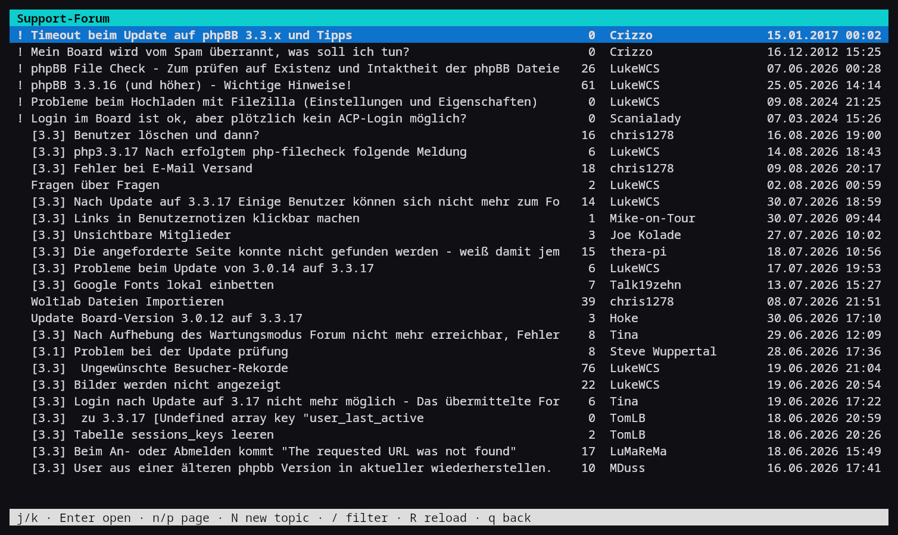
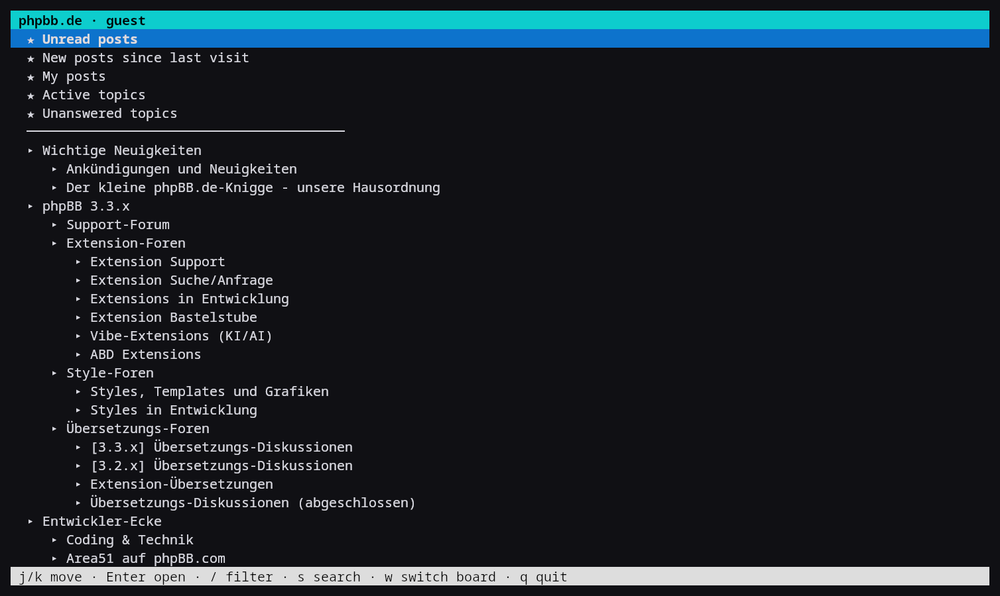
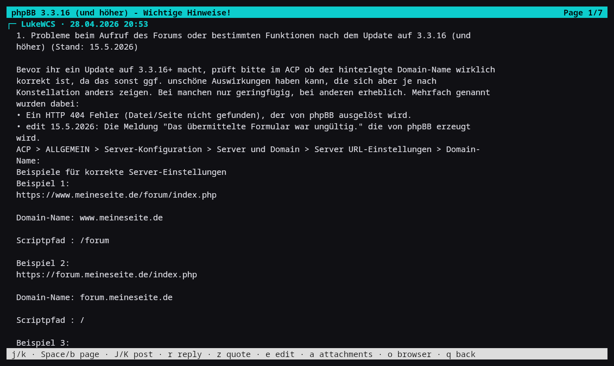

# phpbb-tui

Read and write phpBB forums from the terminal. Write posts in **Markdown** in
your own `$EDITOR`; they are converted to BBCode on send.



One line per topic — about thirty per screen. In a text browser the same page
shows **two**, because phpBB ships every topic row twice (desktop columns plus
a `responsive-show` block for phones) and a graphical browser hides one of them.

The forum tree comes from the board's own jump box, so it includes every forum
you may see:



Threads are plain text, with `┌─ author · date` between posts and quotes
indented:



*(Screenshots taken from the public phpBB.de support board, read as a guest
with `phpbb-tui phpbb.de --guest`.)*

## Why this exists

There is no maintained terminal client for phpBB. The only one findable is
`xqtr/phpbb-cli` — Pascal, two commits, 2017, read-only. `forum-dl` handles
phpBB but cannot log in. NNTP bridges and the unofficial REST API are
*server-side* extensions: the board owner must install them, so they are no
help to a normal user.

The reason the field is empty: phpBB has no public API (the bundled CLI is
server administration), and every board renders its own HTML. A client aiming
at *all* phpBB boards breaks on the next theme update. This one aims at the
subset every prosilver-derived board shares, which in practice is most of them.

## Install

Python 3.11+ and `requests`. Nothing else — the interface uses `curses` from
the standard library, and HTML is parsed with `re` and `html.parser`.

```sh
git clone https://github.com/drdewes/phpbb-tui ~/src/phpbb-tui
ln -s ~/src/phpbb-tui/phpbb-tui.sh ~/.local/bin/phpbb-tui
phpbb-tui add https://forum.example.org/forum
```

`add` fetches the board, stores it in `~/.config/phpbb-tui/boards.toml` and
logs you in. Your password is never stored — only the session cookie, in
`~/.local/state/phpbb-tui/<board>.cookies.txt` (mode 600).

## Usage

```
phpbb-tui                 start (asks which board if several)
phpbb-tui <name>          open a specific board
phpbb-tui add <url>       add a board
phpbb-tui login <name>    log in again
phpbb-tui list            show configured boards
phpbb-tui logout <name>   drop the session
phpbb-tui <name> --guest  read without an account (boards that allow guests)
```

Vim keys throughout:

| Key | Action |
|-----|--------|
| `j` `k` | move |
| `l` `Enter` | open |
| `h` `q` | back |
| `Ctrl-D` `Ctrl-U` | half page |
| `g` `G` | top / bottom |
| `Space` `b` | page down / up |
| `n` `p` | next / previous page of results |
| `/` | filter the list |
| `s` | search the board |
| `w` | switch board |
| `N` | new topic |
| `r` | reply |
| `z` | quote reply |
| `e` | edit your own post |
| `a` | attachments of the current post |
| `J` `K` | next / previous post in a thread |
| `o` | open in the system browser |

## Writing

`r`, `z`, `e` and `N` open `$EDITOR` on a Markdown file. The first line
(`# …`) is the subject. On save, the forum itself renders the preview — so you
see exactly what will appear — and only `a` sends it.

| Markdown | becomes |
|----------|---------|
| `**bold**` | `[b]…[/b]` |
| `*italic*` | `[i]…[/i]` |
| `> quote` | `[quote]…[/quote]` |
| `> **Name:**` as first line | `[quote="Name"]` |
| `- item` / `1. item` | `[list]` / `[list=1]` |
| `[text](url)` | `[url=…]…[/url]` |
| fenced block | `[code]…[/code]` |
| `# heading` | bold — BBCode has no headings |

Quoting round-trips losslessly: `[quote="someone"]` becomes
`> **someone:**` for editing and turns back into `[quote="someone"]` on send.
Inline code stays plain text, because plain phpBB has no inline-code tag and
`[c]` would appear literally in the post.

## Attachments

In a thread, `a` lists the attachments of the post under the cursor; `Enter`
downloads and opens one, `s` only saves it (to `~/Downloads` by default).

While composing, `d` in the preview uploads a file to the open form and `x`
removes the last one. phpBB accepts the upload separately from the post and
hands the file back through the form as `attachment_data[n][…]` fields, which
must travel with the final submit — this client re-reads the whole form after
each upload so nothing is lost.

## Configuration

`~/.config/phpbb-tui/boards.toml`:

```toml
downloads = "~/Downloads"
browser   = "xdg-open"

[[board]]
name = "example"
url  = "https://forum.example.org/forum"
user = "myname"
```

`$BROWSER` is deliberately **not** used: on many systems it points at a
terminal browser, which is the last thing you want when opening an attachment.
Override with `PHPBB_TUI_BROWSER`, the editor with `PHPBB_TUI_EDITOR`.

The interface speaks English or German. It follows your locale; force it with
`PHPBB_TUI_LANG=en` or `PHPBB_TUI_LANG=de`.

## Two things phpBB does that will cost you an afternoon

**A form submitted in the same second is rejected.** `check_form_key` computes
`$diff = time() - $creation_time` and then tests `if ($diff && …)` — which is
false when `$diff` is 0. A human typing a password always takes longer than a
second; a program does not, and gets *"The submitted form was invalid"*, which
reads exactly like a wrong password. This client waits until the form is old
enough before every POST.

**Do not treat `class="error"` as failure.** It also occurs in the page
scaffolding of successful posts. Check positively instead: the success message,
or the meta-refresh to `viewtopic.php…#pNNN`.

Two smaller ones, for anyone parsing prosilver: do not cut topic rows at the
next `</li>` (multi-page topics carry their own `<li>` page list inside the
row), and read the topic starter from `topic-poster` — the first username in
the row belongs to the mobile block and is the *last* poster.

## Finding the forums

The board index is not a reliable source: some boards list only a fraction of
their forums there. The **jump box** at the bottom of every forum page lists
every forum the logged-in user may see, with indentation, so that is what this
client reads.

## Limitations

Private messages, polls and moderation are not implemented; press `o` and
continue in the browser. Tested against phpBB 3.3 with a prosilver-derived
style.

## License

MIT

---

# phpbb-tui (deutsch)

phpBB-Foren im Terminal lesen und schreiben. Beiträge entstehen in **Markdown**
im eigenen `$EDITOR` und werden beim Senden nach BBCode gewandelt.

Es gibt keinen gepflegten Terminal-Client für phpBB — der einzige auffindbare
hat zwei Commits von 2017 und kann nur lesen. Der Grund: phpBB hat keine
öffentliche Schnittstelle, und jedes Board liefert eigenes HTML.

**Einrichten**

```sh
ln -s ~/src/phpbb-tui/phpbb-tui.sh ~/.local/bin/phpbb-tui
phpbb-tui add https://forum.example.org/forum
```

Das Passwort wird nirgends gespeichert, nur das Sitzungs-Cookie. Boards mit
Gastzugang lassen sich auch ohne Konto lesen: `phpbb-tui <name> --guest`.

**Bedienung** — Vim-Tasten: `j`/`k` bewegen, `l`/Enter öffnen, `h`/`q` zurück,
`^D`/`^U` halbe Seite, `g`/`G` Anfang/Ende, `n`/`p` Seite blättern, `/`
filtern, `s` suchen, `w` Forum wechseln, `N` neues Thema, `r` antworten, `z`
zitieren, `e` eigenen Beitrag bearbeiten, `a` Anhänge, `J`/`K` Beitrag
weiter/zurück, `o` im Browser öffnen.

**Schreiben** — erste Zeile mit `#` ist der Betreff. Nach dem Speichern zeigt
das Forum selbst die Vorschau; erst `a` sendet ab. Zitate laufen verlustfrei in
beide Richtungen.

**Anhänge** — im Thread listet `a` die Anhänge des Beitrags, Enter lädt und
öffnet, `s` speichert nur. Beim Schreiben hängt `d` in der Vorschau eine Datei
an, `x` entfernt die letzte.

**Zwei phpBB-Eigenheiten**, die Zeit kosten: Ein Formular, das in derselben
Sekunde zurückkommt, gilt als ungültig (`if ($diff && …)` in `check_form_key`)
— das sieht aus wie ein Passwortfehler. Und ein `class="error"` im HTML ist
kein Fehler; das steht auch auf Erfolgsseiten. Erfolg positiv prüfen.
